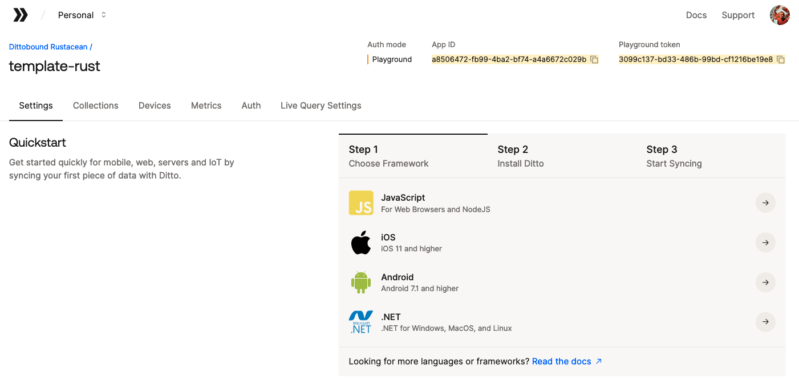

# `template-rust`

This is a template starter project for showing how to develop
applications using Ditto's Rust SDK.

## About Ditto

[Ditto is an "edge-sync platform"][0], which allows your apps to
work and communicate even while offline. The Ditto SDKs allow
you to read and write changes to a local database even while
offline, but will automatically connect to nearby peers and sync
changes with each other.

- [Ditto Rust API Docs][1]

## Getting Started

To get started with Ditto, [visit the Ditto Portal and create an App][2],
then find your "App ID" and Playground Token. You'll use these to
authenticate your SDK instances so they can securely sync with each other.



> The AppID and token in this screenshot are fake, you need to create
> your own Ditto account and App, then copy the AppID and Playground Token
> generated for you :)

Next, copy the `.env.sample` file and rename it to `.env` to use it:

```
cp .env.sample .env
```

Edit the `.env` file and paste your App ID and Playground Token:

```
#!/usr/bin/env bash
# ...

export APP_ID=""           # Your App ID
export PLAYGROUND_TOKEN="" # Your Playground Token
```

Now you can build and run the available sample apps. Be sure to check the
`--help` menu to see subcommands and options for each app.

### Simple Querybuilder

```
cargo run --bin=simple_querybuilder -- --collection="cars"
# ...
Inserted document with id=6659efed00288113001bb5a9
```

### Simple DQL

```
cargo run --bin=simple_dql -- create-car --make="ford" --year="2016" --color="blue"

cargo run --bin=simple_dql -- query-cars --color="blue"
```

[0]: https://ditto.live
[1]: https://docs.rs/dittolive-ditto
[2]: https://portal.ditto.live

